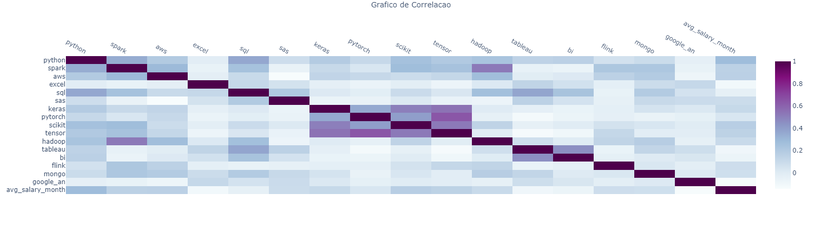

[](https://www.linkedin.com/in/felipe-roll/)


# Project Overview: 
<b>This project aims to create a simple *Streamlit web application* that allows users to input if they have a certain sklill and see as a result an estimated salary in a data science role

# Code and Resources used:
* **python = "^3.12"**
* **requests = "^2.32.3"**
* **streamlit = "^1.37.1"**
* **pandas = "^2.2.2"**
* **scikit-learn = "^1.5.1"**
* **plotly = "^5.23.0"**
* **nbformat = "^5.10.4"**
* **fsspec = "^2024.6.1"**

 # Data Cleaning steps:
* Dropped all columns that are not skills or the target variable "avg_salary_month"
* Normalized the data using *MinMaxScaler*

# Exploratory Data Analysis:
* Looked at the correlation between those columns

  

# Machine Learning Model
* Separated the target variable from the others and split the data in 70% train and 30% test
* Used linear regression to fit the model
* Tested the model without any changes, with padronization and with normalization to observe the best result
* Obtained a ```Mean Absolute Error (MAE) Score of 0.11560831489129772``` and ```Mean Squared Error (MSE) score of: 0.021373512517759537``` in the normalization process, which were the best scores

# Streamlit deploy
* Created a small streamlit webapp and deployed the model

# How to use
* Just acess [DS Salary](https://ds-salary.streamlit.app) and try it!! OR;
* Create a virtual enviroment using poetry;
* Install the libraries by running ```poetry install```;
* Run it with ```streamlit run app.py```


# Developed by: 
  * [Felipe Roll - LinkedIn](https://www.linkedin.com/in/felipe-roll)
  * [Felipe Roll - GitHub](https://github.com/FelipeLRoll)
  * [Felipe Roll - Gmail](felipelroll@gmail.com)
